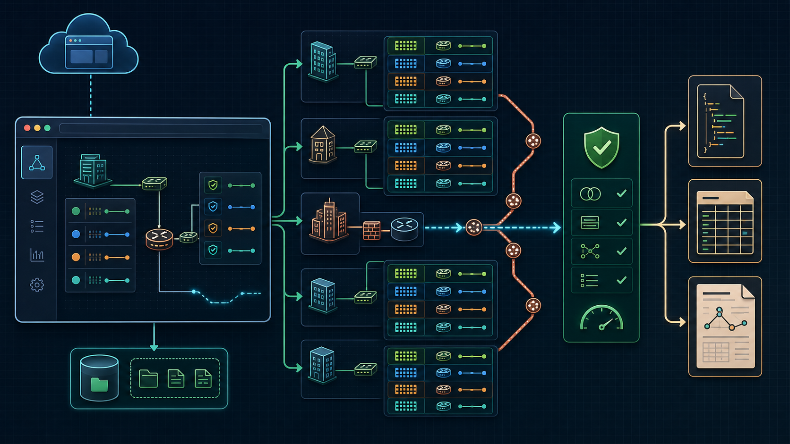
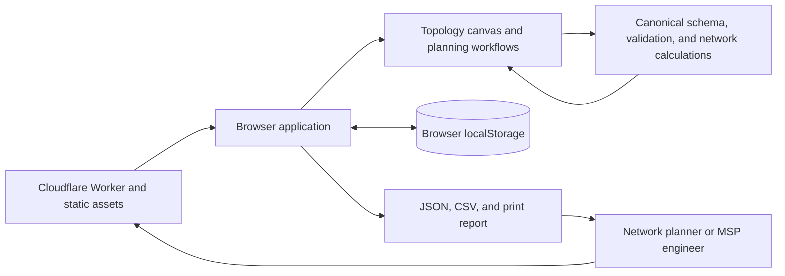

# Network Planner Studio architecture

Last reviewed: 2026-08-23

Network Planner Studio is a local-first IPv4 design workbench. Cloudflare serves the application, while network designs, calculations, history, and exports remain in the user's browser unless the user deliberately downloads or imports a file.

The infographic is a conceptual overview. The implemented browser and Worker boundaries are described below.

## What the product does

The workbench models existing and planned network environments through:

- sites, parent address ranges, VLANs, roles, gateways, capacities, DHCP pools, and reservations
- hub, spoke, standalone, VPN, private-WAN, peering, and internet connections
- static and BGP routing intent, advertised prefixes, default routes, and breakout
- overlap, containment, gateway, broadcast, capacity, pool, reservation, enum, and identifier validation
- trust-zone traffic policies and implementation assumptions
- animated multi-hop route tracing through transit hubs
- recommendation workflows using the same canonical schema as manual entry
- local projects, undo and redo, JSON migration, lossless CSV exchange, and print-ready reports

The application plans and explains intent. It does not discover live infrastructure or push configuration.

## System context

No project-data arrow returns to Cloudflare because normal designs are processed and stored locally.

## Runtime components

| Component | Responsibility | Primary source |
| --- | --- | --- |
| Cloudflare Worker | Serves static assets with security and cross-origin isolation headers, canonical-host redirects, a branded 404 page, and a small health endpoint | `worker.js` |
| Browser shell | Manages project workflows, forms, topology interaction, persistence, import, export, report rendering, and accessibility state | `public/app.js` |
| Network core | Owns schema v3, normalization, validation, IPv4 and CIDR math, allocation, topology, routing, trace, migration, CSV, and report data | `public/network-core.js` |
| Static UI | Defines the application structure and styling | `public/index.html`, `public/styles.css` |
| Local project store | Persists serialized versioned projects in browser storage | Browser `localStorage` |
| Export boundary | Produces JSON, CSV, and print-ready HTML for user-controlled download or PDF printing | Browser application |

## Canonical data model

The root schema identifier is `network-planner-studio/design`, version 3. The design contains:

- project metadata, assumptions, unresolved decisions, and release/schema provenance
- sites with stable IDs, topology roles, parent allocation ranges, hub assignments, and WAN intent
- VLANs with stable IDs, numeric VLAN IDs, roles, subnets, editable gateways, capacity, DHCP state, explicit pools, reservations, and notes
- links with stable IDs, endpoints, connection type, routing mode, advertised prefixes, default-route intent, and implementation notes
- trust-zone policies with constrained source, destination, action, and rationale fields

Every entry path uses shared factories and validators. Manual forms, recommendations, JSON migration, and CSV import therefore produce the same normalized structures.

## Planning flow

1. The browser loads the static application from Cloudflare.
2. The user opens or creates a project stored in local browser storage.
3. Sites, VLANs, links, routes, policies, and assumptions pass through the canonical schema factories.
4. Hard validation rejects malformed CIDRs, duplicates, invalid enums, dangling links, non-contained ranges, unsafe gateways, pool conflicts, and invalid reservations.
5. Design guidance evaluates topology and operational intent separately from hard validity.
6. The topology canvas renders the normalized model. Route tracing runs shortest-path and routing-intent calculations locally. Canvas layout is measured while the view is visible; edits made from other tabs defer the layout and it is flushed when Topology is opened again.
7. Undo and redo preserve local editing history.
8. Export serializes the same canonical model to versioned JSON, expanded CSV, or a print-ready implementation report.
9. Import validates and either accepts, migrates with warnings, or visibly rejects invalid source data.

## IPv4 rules

- Allocation networks accept `/8` through `/31`.
- Route intent accepts `/0` through `/32`.
- `/31` is supported for point-to-point transit.
- Network and broadcast addresses, gateways, reservations, and explicit pools are validated by subnet type.
- The VLAN form accepts a custom usable gateway and defaults to the first usable address when the field is blank.
- A reservation count covers the first usable addresses. A gateway outside that low-address block reduces endpoint capacity separately, and an automatic DHCP pool chooses the larger contiguous range that excludes it.
- Duplicate IDs and duplicate VLAN IDs inside one site are rejected.
- Editing a VLAN or link preserves its stable object ID. Automatic VLAN-ID selection searches the full valid range and reports exhaustion instead of returning an occupied ID.
- Existing address space is preserved unless the user deliberately changes it.

## Third-party services and dependencies

| Service or platform | Use | Project data sent | Required |
| --- | --- | --- | --- |
| Cloudflare Workers | Serves the application, redirects aliases, exposes `/api/health`, and provides server-side request observability | No project payload is submitted by normal use | Yes for hosted use |
| Cloudflare Workers Assets | Serves HTML, CSS, JavaScript, icons, robots, and sitemap | No project data | Yes for hosted use |
| Browser `localStorage` | Stores projects on the user's device. The current design and a 20-project library (most recently updated, current project always kept) are written through debounced saves; undo history is capped at 40 in-memory snapshots | Data stays in that browser profile | Optional persistence |
| Browser print and download APIs | Produces user-controlled files and PDF handoff | Data leaves only through user-directed export | Optional |

There is no runtime database, analytics service, authentication provider, remote planner API, MCP server, cloud project sync, live network discovery, vendor controller, or RMM integration.

## Privacy and trust boundary

- Designs are private and local by default.
- Cloudflare receives normal web request metadata for application assets and health checks.
- Site names, IP ranges, policies, assumptions, and implementation notes are not sent to an application backend during normal planning.
- Imports are untrusted input and are schema-validated before use. JSON and CSV imports above 10 MB are rejected before parsing.
- Dynamic values are escaped or enum-constrained before rendering.
- Storage failure is reported to the user rather than silently discarding changes.
- Exported files become the user's responsibility once downloaded or shared.
- Exported CSV cells use a reversible spreadsheet-formula guard, including values with a legitimate leading apostrophe and formulas hidden behind whitespace.
- Animation respects `prefers-reduced-motion`: hero flow lines, pulse indicators and trace particles are disabled when reduced motion is requested.

## Interfaces

The product is intentionally browser-first.

| Interface | Purpose |
| --- | --- |
| `/` | Complete planning application |
| `GET`, `HEAD`, or `OPTIONS /api/health` | Service, schema, and release liveness |
| JSON import and export | Lossless versioned design exchange |
| CSV import and export | Address-plan and topology exchange |
| Print report | Human implementation handoff and PDF generation |

There is no public project-processing REST API or MCP interface. Adding one would change the local-first privacy boundary and requires a separate product decision.

## Deployment topology

One Cloudflare Worker serves `network.illek.ie` and the compatibility hostname `netplanner.illek.ie` through custom domains. The `public/` directory is deployed as a Worker asset binding. Observability is enabled, while `workers.dev`, preview URLs, Pages, D1, KV, R2, Queues, and Durable Objects are absent.

## Failure model

- Invalid input is rejected or quarantined with visible warnings.
- Browser-storage failure leaves the current in-memory design available and shows recovery guidance.
- If the same design is open in two browser tabs, a save from one tab warns the other instead of merging. Storage holds whichever tab wrote last, so the warned tab should export its in-memory copy before reloading or keep editing to overwrite the stored version.
- A missing network path produces an unavailable trace rather than an invented route.
- Strict v3 import rejects invalid numeric and boolean types. Lenient recovery bounds legacy or damaged values and lists every correction in Design review.
- The application continues to work without storage, although projects will not persist after the session.

## Accessibility model

- Landmarks, skip link, roving-tabindex tabs, keyboard-operable rows, nodes and WAN links, live form errors, and focus preservation across selection re-renders keep the planner operable without a pointer. Focus keeping also covers dialog-driven edits from inspector actions and the per-site VLAN shortcut, falling back to the inspector container when the originating control no longer exists. The topology canvas is a named region so its label reaches screen readers.
- The mobile Sites drawer keeps `aria-expanded` truthful across every close path, including selecting a site or VLAN from the drawer itself.
- Touch targets meet 44 px on coarse pointers; reduced-motion preferences disable decorative animation.
- On touch screens the canvas claims its gestures with `touch-action: none`, two-finger pinch zooms within the same clamped range as the zoom controls, and a cancelled or interrupted gesture aborts cleanly instead of leaving a stuck drag. A cancelled node drag also returns the site to its pre-drag position. Consecutive arrow-key nudges of one node record one undo entry; moving another node or using undo or redo starts a new history entry.

## Non-goals

The current product does not support IPv6, VRF, live discovery, controller login, configuration generation, configuration pushing, cloud collaboration, tenant accounts, or vendor-specific deployment validation.

## Verification map

- Core schema and network tests: `npm test`
- Browser workflow and accessibility tests: `npm run test:e2e`
- Worker and static source: `worker.js`, `public/`
- Canonical model and calculations: `public/network-core.js`
- Browser orchestration: `public/app.js`
