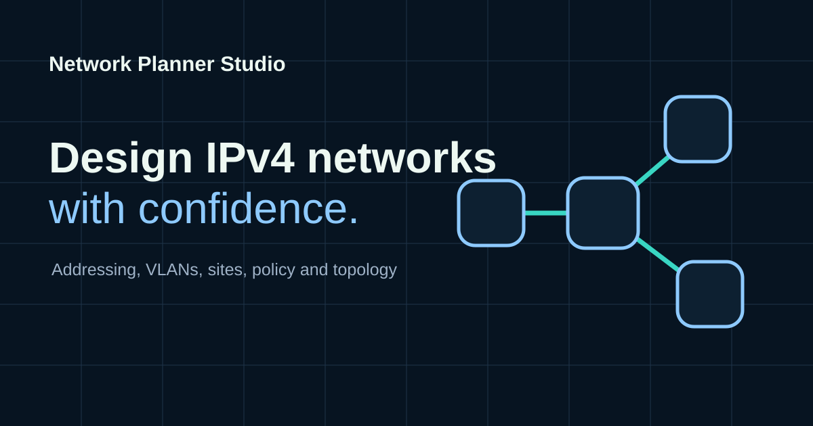
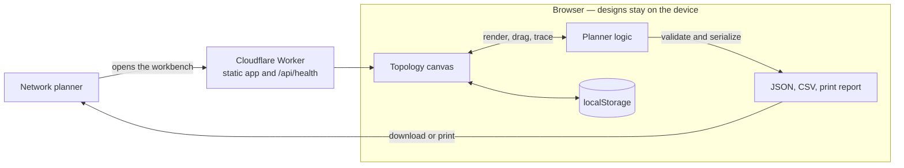

# Network Planner Studio

**IPv4 network design, made visible.** Drag sites on a live topology canvas
while addressing, routing and policy are checked in the browser.

<p align="center">
  <a href="https://network.illek.ie/">
    
  </a>
</p>

Map existing ranges or plan a new site, VLAN and WAN layout. The canvas is the
primary surface: nodes, links and animated traces stay in view, and precise
CIDRs remain in the address-plan tables. Designs are private and local by
default — Cloudflare serves the app; nothing is posted to a planning API.

Live at [network.illek.ie](https://network.illek.ie).

## How a design flows

The topology canvas, planner logic and exports share one canonical model
(`network-planner-studio/design` v3). Edits on the canvas and in the forms go
through the same factories and validators that accept or reject imports.




Cloudflare receives normal web-request metadata for assets and health checks.
Site names, IP ranges, policies and notes never leave the browser unless the
user exports a file.

Component boundaries, IPv4 rules, privacy, failure handling and accessibility
are in **[ARCHITECTURE.md](ARCHITECTURE.md)**.

## Product principles

- Existing address space is entered without being silently changed.
- New subnets are allocated inside an explicit site parent range.
- Hard errors (invalid or overlapping ranges) are distinct from design advice.
- The canvas is visual; precise address data remains available in tables.
- Designs are private and local by default.

## Features

**Canvas.** Draggable multi-site topology with zoom, pan, pinch, fit-to-screen,
undoable keyboard nudges and a mobile site drawer. Site-tree search and a
collapsed overview for large imports. Hub-and-spoke wizard with radial
auto-layout. Animated multi-hop route tracing through transit hubs.

**Addressing and WAN.** Existing-network and new-network entry. VLAN roles,
capacity, editable gateways, DHCP pools and reservations, including `/31`
transit. VPN, private WAN, peering and internet links with hub, spoke or
standalone roles. Static or BGP routing intent, advertised prefixes and
default routes.

**Review.** Overlap, containment and capacity validation. Single-WAN,
segmentation and management-network guidance. Trust-zone traffic policy
matrix. Design assumptions and implementation notes.

**Handoff.** Local projects with duplicate, open and delete. Undo/redo.
Versioned JSON plus RFC 4180 CSV. Print-ready implementation report for PDF.

## Quickstart

### Run

```sh
npm install
npm run dev
```

Open [http://127.0.0.1:8787](http://127.0.0.1:8787). The health endpoint is
`/api/health`. Designs stay in the browser.

### Test

```sh
npm test
npm run test:e2e
```

`npm test` covers schema and network calculations. `npm run test:e2e` covers
browser workflows.

### Deploy

```sh
npm run check:release
npm run deploy
```

The Worker serves `public/` as static assets and uses no database or paid
binding. The release gate checks package, lockfile, health and schema
provenance, then runs the unit suite, browser suite, dependency audit and a
Wrangler dry run.

[RELEASE.md](RELEASE.md) has acceptance checks and the post-deploy production
smoke test (`npm run check:production`).
